# PROYECTO DATA LOVERS

## Índice

* [Introducción](#introducción)
* [Definición del Producto](#Definición-del-Producto)
* [Historias de usuario](#Historias-de-usuario)
* [Prototipos](#Prototipos)
* [Tests de usabilidad](#Tests-de-usabilidad)
* [Información adicional sobre el proyecto](#Información-adicional-sobre-el-proyecto)

***

## Introducción

En la actualidad, muchas personas sufren accidentes en diferentes puntos de un medio de transporte. La información que presentaremos en nuestro proyecto es Data del Gobierno de Estados Unidos, registrada desde 1960 al 2016; esta información almacena el número de personas heridas a través de algún medio de trasporte, como por ejemplo: personas hereidas en carreteras, personas heridas en Aerolíneas de EEUU, etc.

## Definición del Producto

Esta web ha sido desarrollada para mostrar la información solcitada por nuestros usuarios, que permitirá mostrar la información más relevante sobre el número de personas accidentadas en difirentes tipos de medios de tranporte en los Estados Unidos.

Cuenta con filtros que permitirán al usuario señalar el tipo de año o el rango de años específico a mostrar en pantalla. Asimismo cuenta con menú de selección que brindará al usuario la experiencia de poder ordenar de forma ascendente o descendente. Finalmente el usuario podrá mostrar la suma total de Heridos en accidentes.

## Historias de usuario

Para definir las historias de nuestros usuarios, procedimos a definir un grupo de interés para nuestra información. En la búsqueda de usuarios que puedan requerir de este tipo de data, encontramos a viajeros, brockers de seguros, conductores, etc. 

Al realizar las entrevistas con nuestros usuarios nos dimos cuenta que esta información no era la más adecuada para ellos, ya que nuestros entrevistados solicitaban otro tipo de información, pero tratamos de rescatar lo más resaltante de esto, como por ejemplo:

> "Cómo es el cambio de la cantidad de accidentes a través de los años" - José - 31 años   
> "Me gustaría poder conocer cual es el mayor número de accidentes en alguna área o medio en específico" - José     Coronel - 42 años   
> "Me gustaría ver una pantalla con muchos botones, que no tenga que escribir mucho ya que si voy en el auto y me estaciono a un lado no puedo perder mucho tiempo - Marilú - 40 años   

Las entrevistas al detalle podrán ser revisadas al final de este documento [Anexo](#anexo)

En base a eso destacamos las siguientes historias de usuario:

#### - Mi usuario desea poder visualizar la cantidad de heridos por accidentes por años (Año en específico o rango de años)    
#### - Mi usuario desea poder visualizar la informacion ordenada de por los últimos o primeros años registrados.   
#### - Mi usuario desea poder visualizar el número de total de accidentados durante todos los años registrados.    

## Prototipos

En base a las historias de usuarios creamos un primer prototipo de baja fidelidad que nos mostraba lo siguiente:    

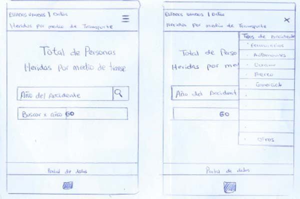
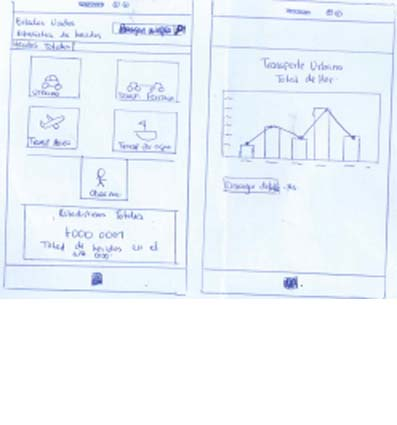

Después del primer testeo entre algunos de nuestros usuarios nos dimos cuenta que lo que ellos solicitaban no estaba de acuerdo a lo que nosotros inicialmente habíamos planteado, por lo que surgió un segundo diseño de baja fidelidad que mostraba lo siguiente:    

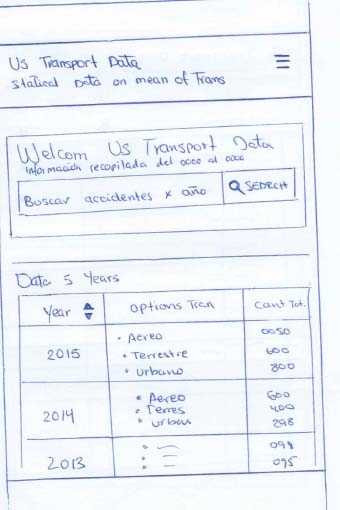
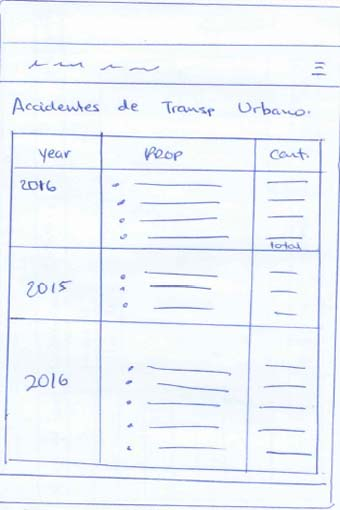

En base a este diseño empezamos a diseñar nuestro HTML con algunas cosas básicas, pero mediante transcurria el proceso, solicitamos feedback a usuarios y compañeras de clase, lo que nos permitió corregir los errores pertinentes y terminar con esta versión del prototipo, teniendo en cuenta los tamaños de pantallas que deseabamos armar de tal manera que fueran de tipo responsive.

### Tamaños de pantallas

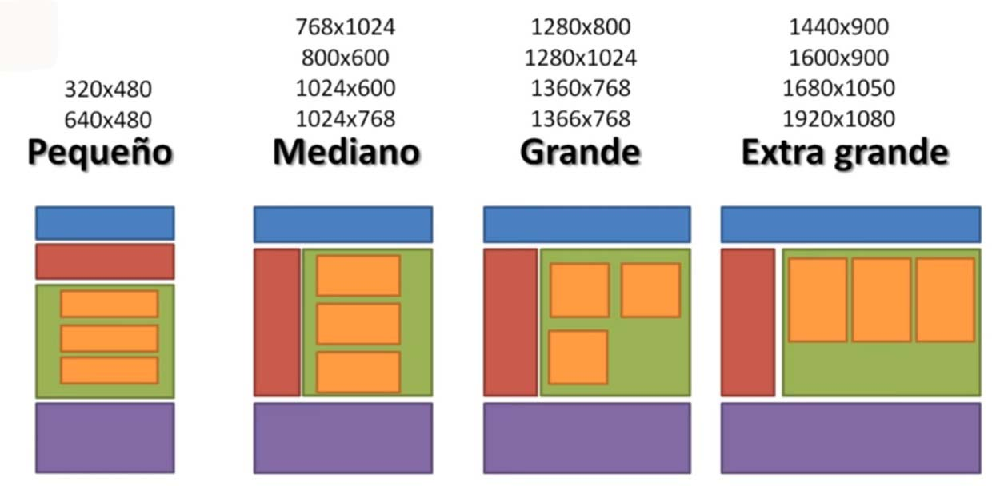       

Diseño de Escritorio
====================

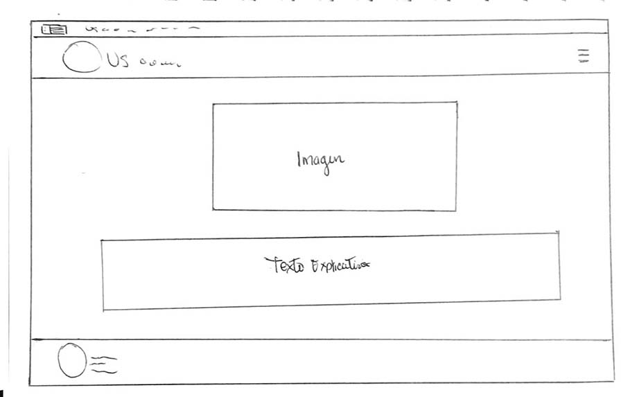
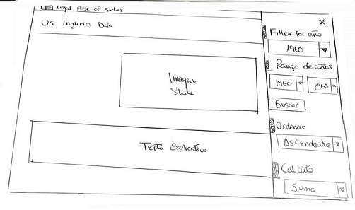
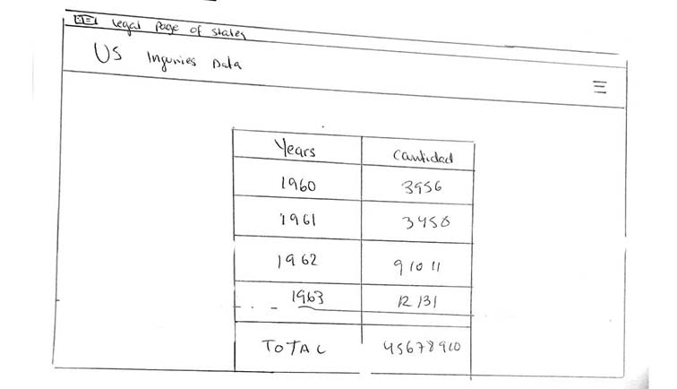
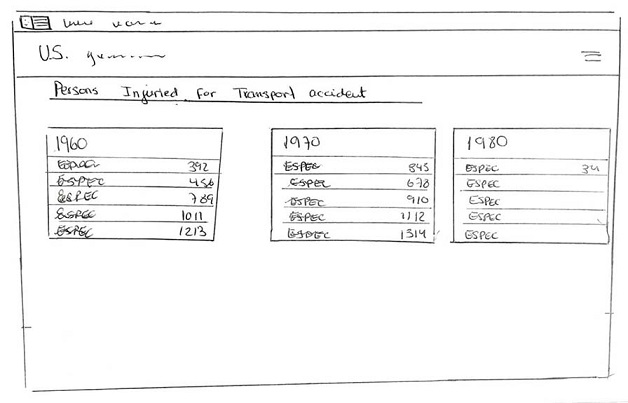
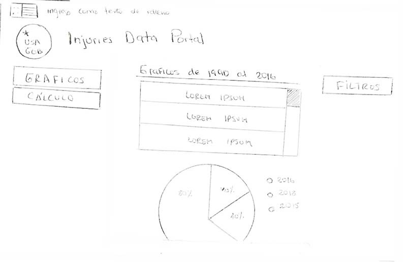
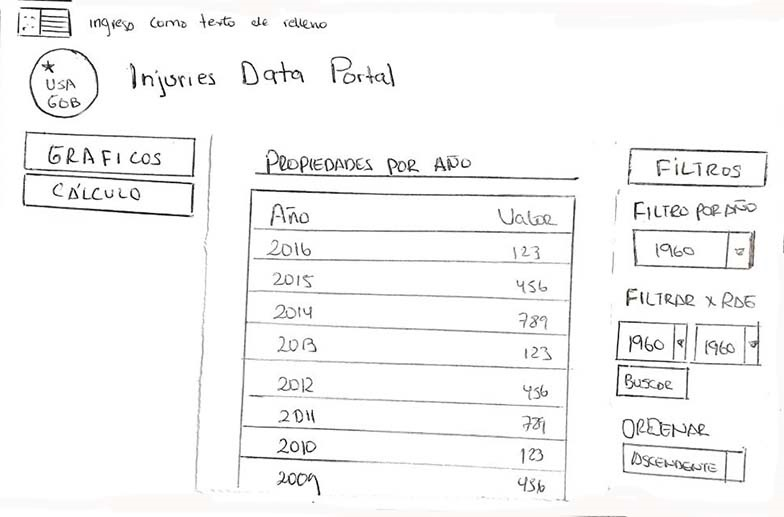
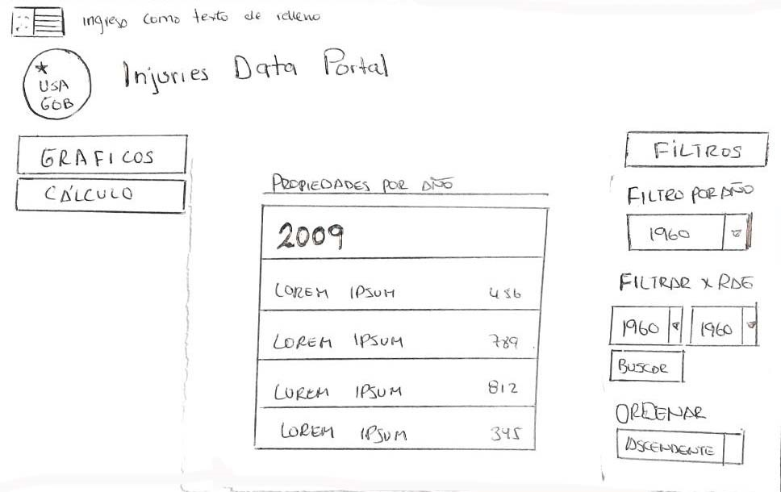
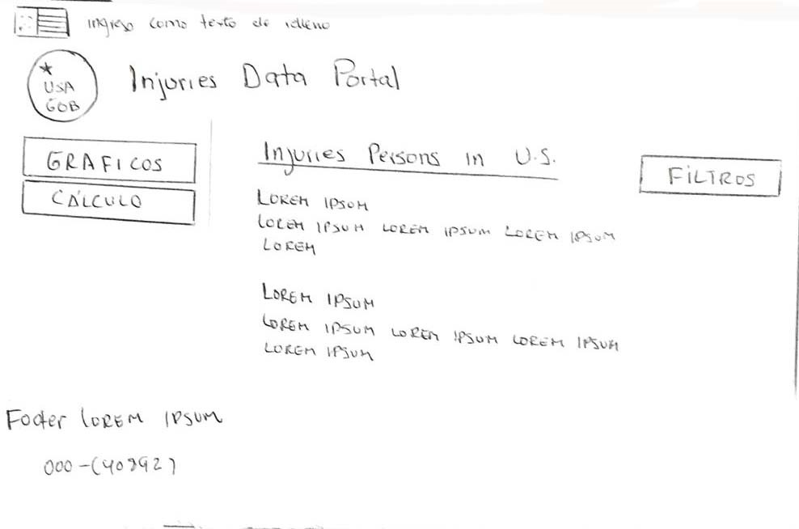      

Diseño de Movil
================

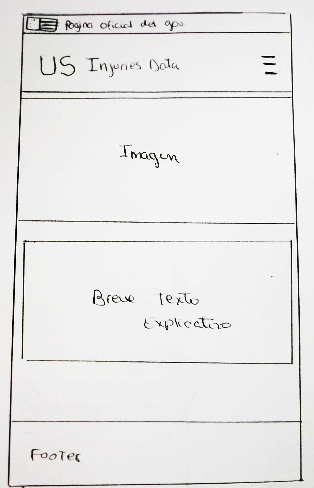
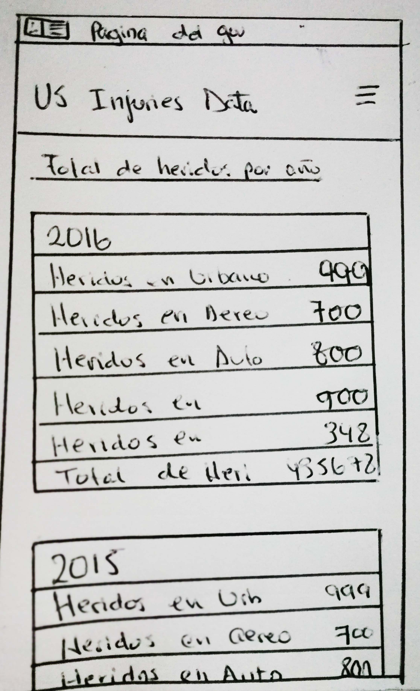
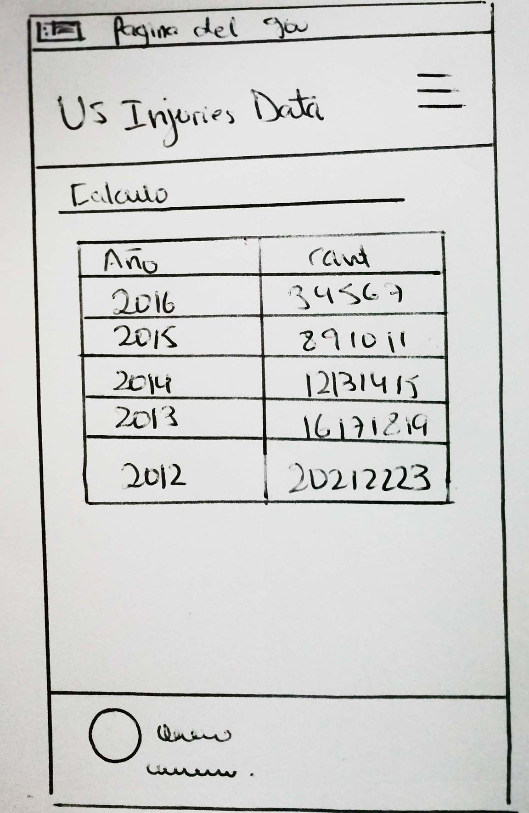      

En el trascurso de la primera y segunda semana del inicio del proyecto se fue armando la primera versión de la aplicación en FIGMA, que nos permitió tener una vista más visual de lo que se quería conseguir, lastimosamente no fue lo solicitado por el usuario por lo que tuvimos que descartar parte de este diseño y armar la versión 3 de baja fidelidad.     

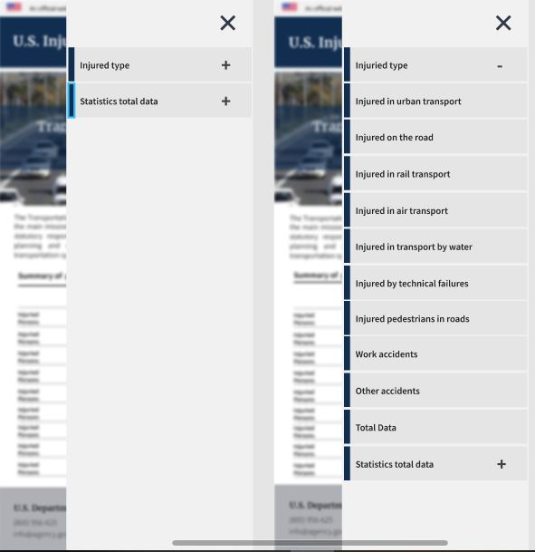

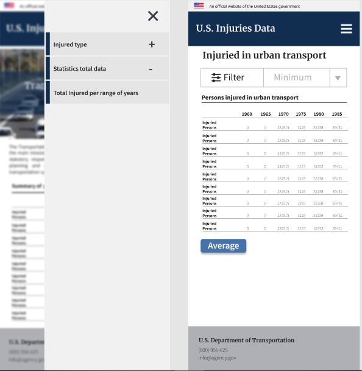     

Quedando como resultado final para el proyecto las siguientes imagenes:        

           

Asimismo se trabajo con el programa Zeplin a fin de obtener mejores resultados entre el diseño y la programación:      

[Figma Proyecto](https://www.figma.com/file/eMvpstIQx6KvLkuu4c8H8ccN/Untitled?node-id=0%3A1)     
[Zeplin Proyecto](https://zpl.io/2jv7pAQ)     

## Tests de usabilidad     

Nuestros usuarios al probar nuestra aplicación detectaron los siguientes problemas:     

1. El menú de navegación no es óptimo ya que todo está en un solo lado.
2. Debería de poder filtrar por algún campo específico y no solo por años.
3. La web debería de poder mostrar gráficos estadísticos que permita ser más visible la información.
4. Debería de tener un botón de refrescar página para que se pueda borrar el contenido anterior.

## Información adicional sobre el proyecto

Cabe resaltar que para integrar toda esta información del proyecto se realizó un trabajo previo de investigación sobre los accidentes de EEUU en la que se puede apreciar que el más alto índice de accidentes se presenta en las carreteras y siendo el medio de transporte más seguro los aviones.

Asimismo se pudo evidenciar a que a diferencia del Perú nuestros usuarios requieren de una aplicación que interacctue con un mapa que pueda mostrar y registrar estadísticas de accidentes en carretera en determinados puntos de nuestra capital, a fin ellos puedan manejar con más precaución.

***

### Anexo

#### Entrevista N°1  

Nombre: Fernando  
Profesión: Ingeniero de minas  
Edad:  31 años   
Daya:   
Hola buenas tardes Fernando, gracias por permitirme hacerte esta entrevista, te cuento que estoy armando una app que busca mostrar los índices de heridos en accidentes de medio de transporte, quisiera saber en base a tu experiencia manejando datos, que es lo que te gustaría ver primero. ¿Por qué buscarías una app con esos datos y que tipo de uso le darías?  
Fernando:   
Creo que sería bueno por zonas, distritos o provincias, poder agruparlos ya que esto serviría para las empresas de transporte. Yo no lo utilizaría tanto ya que no me traslado mucho, quizá si viajara mucho podría utilizarla, para tener en cuenta que lugares son peligrosos y estar atento. Puede ser un complemento del waze, así pueda mostrar cuales son los lugares donde ha habido más accidentes, así estaría más prevenido ya, pero si fuera una app individual no la utilizaría.   

Daya:   
¿Cómo te gustaría que se te mostrará la información?  

Fernando:   
  
Me gustaría que fuera de manera gráfica, como un adicional al waze, que salga como una “Atención en tal cruce hay un alto índice de accidentes”. Claro que no sé como podrías sacar ese índice en porcentajes y de que tipo son. Por  jemplo “Accidente por no ver semáforo 60%” o “Atropello 30%”, habría que definir este tipo de accidentes, porque uno no puede englobar un todo.   

#### Entrevista N°2   
Nombre: Claudia   
Profesión:    
Edad:  35 años   
Daya:    

Te cuento lo que sucede entonces, estoy armando una app que busca mostrar los índices de heridos en accidentes de medios de transporte. ¿Quisiera saber qué es lo que le gustaría ver en esa app primero? ¿Qué dato le parecería más interesante?  

Claudia:   

En primer lugar saber qué medios de transporte existen costos, rutas, nivel de seguridad en cada uno de ellos. Recomendaciones para un mejor uso de cada alternativa de transporte. Ej. Si es transporte en taxi: recomendar empresas registradas, llamar con anticipación No sé si te estoy ayudando o enredando 🙈  

Yo conozco bastante bien en Chile, Argentina y Canadá. En Buenos Aires hice un curso y tomaba el tren cada día por horas, de ahí combi, otra hora casi y llegaba a mi clase. Nadie me dijo que en el tren robaban... que mejor me salía contratar un taxi directo con mis otras compañeras y pagábamos menos entre todas   

Si harás estadísticas de seguridad en cuanto a incidentes ayudaría a tomar decisiones de qué medio de transporte elegir.   

#### Entrevista N°3   
Nombre: José  
Profesión:   
Edad:  31 años   

Daya:   
Hola, estoy armando una app que busca mostrar los índices de heridos en accidentes de medios de transporte. Data y propiedades. Además, tienes la información de que año fue recabada esa información con respecto a accidentes. ¿Qué podrías sacar con esa información? ¿Qué dato podría ser de utilidad?
Aparte de saber ¿Qué medio de transporte es el más seguro y el más inseguro?   
José:   
Los lugares donde ocurren más accidentes, de qué edades son los más accidentados, ver cómo es el cambio de la cantidad de accidentes en cada zona a través de los años para saber si está empeorando o mejorando y número de accidentes por año.   

#### Entrevista N°4   
Nombre: José Coronel  
Profesión: Broker de seguro   
Edad:  42 años   

Claudia:   
Hola buenas noches mi nombre es Claudia Heredia, quisiera poder realizarte una pequeña entrevista.
¿En qué trabajas?  
José: En una empresa aseguradora OTES   
Claudia: ¿Cuánto tiempo llevas trabajando allí?   
José: Mas de 15 años, ya me acostumbré.   
Claudia: Para realizar el filtrado, para saber a que cliente llegar específicamente, ustedes como determinan que tipo cliente buscar.    
José: Los clientes son recomendados y conocidos de la empresa.   
Claudia: Al momento de ofrecer un seguro de accidentes ¿Qué es lo que tomas en cuenta?   
José: Primero se cotiza después se evalúa la póliza de accidentes, mayormente cubre accidentes de personas, por decir un vehículo si está asegurado a ver si le cubre, a parte del SOAT que cubre, primero utilizan el SOAT y luego empieza a correr el otro seguro.    
Claudia: ¿Qué es lo que tú mejorarías en este sistema de filtrado de clientes?    
José: Me gustaría poder conocer cual es el mayor número de accidentes en alguna área o medio en específico, ya que así podría brindar los seguros a las personas que suelen utilizar esos medios de trabajo.   
Claudia: Si te mostrara una aplicación que te muestre los diferentes tipos de accidentes que una persona x puede sufrir.    
José:  Mas tomaría en cuenta el de accidentes vehiculares, ya que es el índice mas alto y es lo que más se vende.   
Claudia:  Si te pudiera brindar una aplicación que te pueda filtrar el número de personas que sufrieron algún tipo de accidentes ¿te interesaría? ¿por qué?   
José: Si me interesaría, ya que así puedo determinar que tipo de seguro puedo promocionar y como hacerlo a donde enfocarlo. Mayormente es seguros que cubre los que sufren en la carretera. Mayormente vendemos pólizas vehiculares, no contamos mucho con pólizas aéreo y marítimo.

#### Entrevista N°5   
Nombre: Marilú   
Profesión: Contratista - conductora   
Edad:  40 años   

Claudia:   
Hola buenas noches gracias por ayudarme Marilú, me comentabas que durante todo el día tú conduces, ya que te dedicas a la decoración de interiores y estas todo el día de un lado para el otro.   

¿Cuál crees que sería el principal motivo de accidentes?   
Creo que los accidentes de tránsito siempre van a haber mucha responsabilidad del conductor, pero conforme he ido conduciendo me he dado cuenta de que también hay gran parte de responsabilidad del peatón.    

¿En tu experiencia que tan frecuente es ver cruzar de manera imprudente a un peatón?    
Es bastante frecuente, acá en el Perú por lo menos un 70% de personas cruzan de forma imprudente alguna avenida o calle. Creo que se debe que la gente anda apurada y distraída.    

 ¿Si nosotros te ofreciéramos algún tipo de aplicación que te ofreciera registros de accidentes, como te gustaría que se muestre?    
Primero me gustaría verlo por ubicación, luego bueno no sé en una pantalla con muchos botones, que no tenga que escribir mucho ya que si voy en el auto y me estaciono a un lado no puedo perder mucho tiempo. Me gustaría por ejemplo que aparezcan gráficos para ver más simple donde hay más accidentes.
